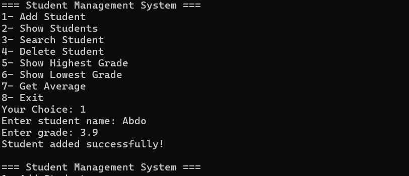
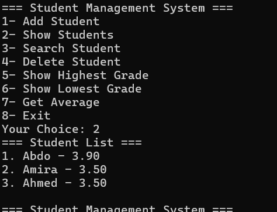
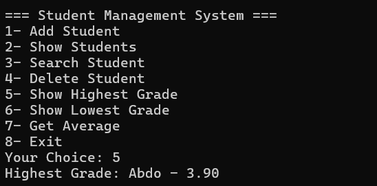
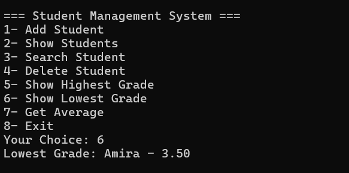
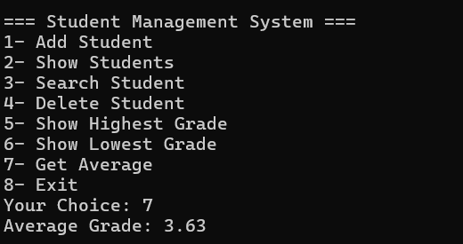
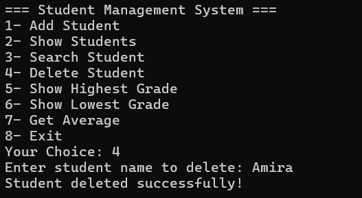
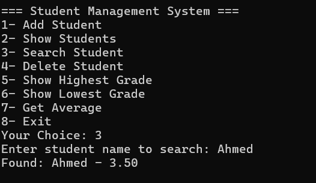
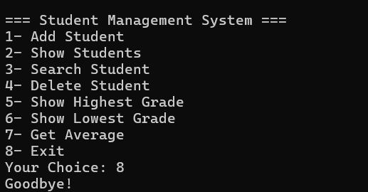

# 🎓 Student Management System (Java)

A simple **Java console application** to manage student data.  
You can add students, search for them, delete them, calculate averages, and display the highest and lowest grades.  
This is a great beginner project to practice **Java OOP** and **basic data structures**. 🚀

---

## ✨ Features
- ➕ Add a new student with name and grade
- 📋 View all students
- 🔍 Search for a student by name
- ❌ Delete a student by name
- 🏆 Show the student with the **highest grade**
- 📉 Show the student with the **lowest grade**
- 📊 Calculate the average grade
- 🔒 Input validation to handle invalid data

---

## 🛠️ Technologies Used
- Java 17+
- IntelliJ IDEA (optional)

---

## 🚀 How to Run
1. Make sure you have Java installed.
2. Clone the repository:
   ```bash
   git clone https://github.com/USERNAME/StudentApp.git
   cd StudentApp
   
3. Compile and run the program:
    ```bash
   javac StudentApp.java
    java StudentApp

## 📂 Project Structure

```sh

new
└── StudentsApp
    ├── StudentApp.class
    ├── StudentApp.java
    ├── README.md
    └── StudentsApp.iml

4 files
```

## 📸 Demo


**Adding a new Student**

**Showing all Students**

**Showing the highest grade**

**Showing the lowest grade**

**Showing Grade Average**

**Deleting s Student**

**Search for a Student**

**Exit the program**

## Contribution 🤝
This is a beginner-friendly project.
Feel free to open a Pull Request if you’d like to add new features or improve it! 💪

